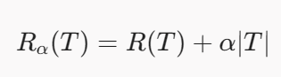

# [W01]

## Why use the F1-score instead of accuracy to evaluate a model?
> give an example: 1000 transaction: 990 normal and 10 fraudulent.
> if model classify all transactions are normal the accuracy = 99%.
> but it mean that that model do not detect eny fradulent transaction -> this model is useless.
>
> for example: in these 10 fraudulent transaction: the model catch 8/10 fraudulent and 10 false alarm.
>
> Accuracy = (980 + 8)/1000 = 98.8%
>
> Precision = 8 / (8+10) = 0.44
>
> Recall = 8/ (8+2) = 0.8
>
> F1-score = 2 * (0.44 * 0.8) / (0.44 + 0.8) = 0.5677

## When use Accuracy vs F1-score
> Use Accuracy when:
> - Classes seperate uniform (50/50 or 60/40 splits).
> - FP and FN carries roughly equal operational weight.
>
> Use F1-Score when:
> - Classes are heavily imbalanced (medical diagnosis, defect detection, anomaly detection, spam filtering).

## What F1-score value is considered good?
> Depending the problem that the model is working, the threshold of "good" F1-score can be different. But normaly F1-score < 0.5 rarely acceptable in standard classification while > 0.9 mean highly seperate classes.

# [W02]

## in decision tree. Why we choose the attribute that have the smallest Gini value to become the root or an internal node?
> Gini value specially use in CART algorithm.
> A smaller Gini value means a purer subset, which is the primary objective of classification: to separate data into groups where all samples belong to the same class.

## to reduce overfitting indecision tree, pruning tree is necessary but How to pruning tree to get the better tree in CART algorithm?
> use Cost-Complexity to evaluate this branch need to be pruned or not.
> 
> R(T) is SSE of this tree.
> Rα(T) is cost-complesity.
> α is Complexity penalty parameter
> T is the number of terminal leaf nodes.

## I don't get in the choosing alpha. To minimize cost-complexity, why we not choose alpha = 0, because R(T) is SSR so it higher than 0 if increase alpha will make cost increase to. so that why when pruning the a branch, the alpha value increase too?
> alpha like the cost of a leave that tree pay for it when they hire leaves to reduce the error.
> if the tree have only root, which mean that the error is the highest, to reduce the error, the tree need to be planted higher. Each leaves for growing tree have a cost to rent. So that wanting reduce error, need rent more leaves with cost alpha. The value of alpha is calculated by dividing the reduction in error by the number of additional leaves—thereby determining the cost associated with each leaf.