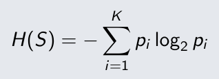
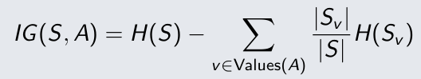
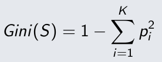

# [PRE-RLEASE] ML workflow, metrics, over/underfitting, bias–variance and decision tree.

## [W01]

### A. Concept capsule
Machine learning is the program that can improve performance of some tasks by learning from experience.

Different problem will use different metrics to evaluate the model.
- Classification: Accuracy, Precision, recall, F1-score
- Regression: MSE, MAE

To traning a machine learning model, first of all must have a dataset. Then processing that dataset.
There are 3 ways to split data.
1. Hold-out.
This way split data set into 3 parts are training set, validation set and test set, typically with proportions of 70%, 15%, and 15%, respectively.

2. k-fold cross validation.
The idea of this method is that split dataset into k parts equally. The training model repeats k times, use k-1 part for training set and the another part be the test set, each time use the different k fold for the test set. The result is the mean of k models that are trained.

3. Bootstrap Evaluation
From the original dataset, pick randomly samples to create a new dataset with the size n. On average, about 36.8% samples have not be chosen, So that use these samples for test set. Repeat this method about 100 ~ 1000 times.

#### over/underfitting and bias-variance.
- underfitting: When the model is too simple compared to the true funciton, leading to that model never fit with the true function -> high bias.
- overfitting: When the model is too complex compared to the true function, leading to that model remember the noise of the data, Which mean that the model tend to try passing all sample in dataset -> high variance.

#### classification metric.
with two class like Yes/No. the confusion metric look like:
| | predicted positive | predited negative|
|:---|:---|:---|
|Actual positive| TP | FN |
|Actual negative| FP | TN |

For example, we set the lable 'yes' is positive.
TP (true positive): predict 'yes' and it true.
TN (true negative): predict the other label (not 'yes') and it true.
FP (false positive): predict 'yes' but actually the true lable is not 'yes' (fail to predict)
FN (false negative): the actual result is 'yes' but model not predict 'yes' (miss to predict)

Accuracy = (TP + TN) / (TP + TN + FP + FN)
Accuracy is the probability that model true for "positive" lable.

Precision = TP / (TP + FP)
Precision is the probability that the lable "positive" is reliable.

Recall = TP / (TP + FN)
Recall is the probability that the model predict "positive" for the number of actually positive.

F1-score = 2* (Precision * Recall) / (Precision + Recall)

[Why some time use F1-score instead of accuracy?](../../AI_use.md#L03)

### B. One Derivation / Worked Example

[Why some time use F1-score instead of accuracy?](../../AI_use.md#L03)

### C. Reflection

I have gained a better understanding of the machine learning model training process and how to evaluate a model's performance. Additionally, I learned about the relationship between bias, variance, and model complexity, enabling me to adjust the model appropriately.

## [W02]

### A. Concept capsule

Decision tree like a flow-chart that the input move from root to the leaf to get the output. 
Decision tree haves three components:
1. Internal node: these feature test have at least 2 outcome, depending the input value, this node will route the corresponding outcome.
2. Edge: are the outcome, of the test.
3. Leaves: leaves are the output of the decision tree.

So how to build a decision tree?
First off all, let talk about the metrics that evaluate the decision tree.

#### Entropy.
Entropy is ther metric that describe how chaotic of the given dataset. If dataset have high entropy which mean that they more miss classes, leading to hard to give the predict, meanwhile low entropy means that dataset have pure class distribution.

the formular calculate entropy:

Information gain:

Information gain is a metric representing the reduction in the dataset's entropy when an attribute is selected as a feature test.

The goal of this metric is try to reduce entropy of the dataset as much as possible to increase the distribution of a class at leaves.
So that we choose the attribute that have the highest information gain to become the feature test.

#### GINI index
The Gini index formular:

Gini index representing how pure of an attribute in the dataset. Gini index for two class have max value = 0.5 which mean this attribute is not pure, and the min value = 0 means absolute pure.

The goal of this metric is to attempt to separate the class distributions of the dataset towards different sub tree.

### B. One Derivation / Worked Example

In the dataset [dataset Human Activity Recognition Using Smartphones](../../data/UCI%20HAR%20Dataset/UCI%20HAR%20Dataset/activity_labels.txt) there are 6 classes.

Assume that all 6 classes are evenly distributed across the dataset, the Gini_index of this dataset will be:

G(S) = 1 - 6 * (1/6)^2 = 1 - 1/6 = 5/6 = 0.8(3)

Which mean that the max Gini index value is 0.8(3) for 6 classes dataset, not 0.5 like two-class dataset.

### C. Code-to-Theory Trace

I wrote an function that calculate the gini index for continuous attribute.

[gini function](../../src/02_decision_tree.py#3)

First of all, I sort the dataset according to the attribute is evaluating. Then I use the mean value between the two adjacent elements. My function have 3 parameter.

> def Gini_index(list_data, avr_adjacent, column):
> # list_data: the sorted dataset according to the chosen attribute.
> # avr_adjacent: the mean value of 2 adjacent value.
> # column: the index of attributing that is used.

I split the dataset into 2 part use avr_adjacent as the boundary.
Then calculate the Gini_impurity of each part, then return after combine them.

### D. Reflection

I have gained a better understanding of the decision tree construction process and learned how to evaluate a tree's performance to determine when pruning is necessary.

### E. Inquiry Trail

I get some trouble about the alpha value in cost-complexity equation. I will spend more time looking into this matter.

